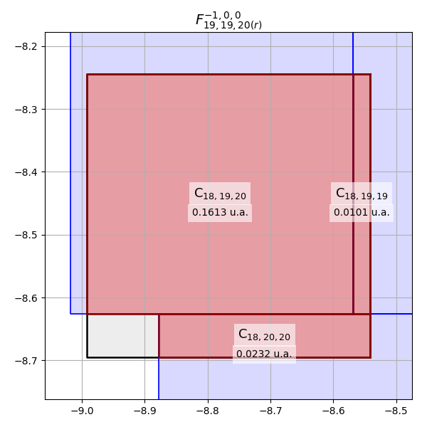

# Cálculo de área de contato entre células vizinhas em malhas não-conformes

Este projeto, intitulado malhas-nao-conformes, implementa o algoritmo de Sutherland Hodgman em uma versão tridimensional 
para calcular a área de contato entre céulas vizinhas em malhas não-confomres
A versão utilizada para desenvolvimento é Python 3.11.2


---
## Ambientes virtuais

É fortemente recomendado a utilização de ambientes virtuais. Para tal, execute no terminal a partir de um path desejado o seguinte comando de acordo com o sistema operacional:

**WINDOWS**:
```
python -m venv env
```

**OS/LINUX**:
```
python3 -m venv env
```

Para ativação do ambiente virutal, execute o seguinte comando de acordo com a platafoma:

**WINDOWS**:
```
<path>\env\Scripts\Activate.ps1
```

**POSIX**:
```
source <path>/env/bin/activate
```

O ambiente virtual será criado.

## Instalando dependências

Todas as dependências do projeto se encontram no arquivo `requirements.txt`. A obtenção é feita a partir da execução do seguinte comando na raiz do projeto:

```
pip install -r requirements.txt
```

As dependências são instaladas.

## Recomendações de uso

Para acionar o código basta rodar da raiz do projeto

```
python main.py
```

O código realiza inicialmente a construção de uma malha (gera uma instância da classe `Malha`) composta por hexaedros 
(cubos ou paralelepípedos) de acordo com os parâmetros fornecidos para a função `cria_malha()`:

```python
def cria_malha(
    comprimento_malha: float,
    largura_malha: float,
    altura_malha: float,
    numero_elementos_x: int,
    numero_elementos_y: int,
    numero_elementos_z: int,
    translacoes_z: bool = False,
    translacoes_yz: bool = False,
) -> Malha:
```

Detalhes sobre os parâmetros:
* `comprimento_malha`: tamanho da malha no eixo x;
* `largura_malha`: tamanho da malha no eixo y;
* `altura_malha`: tamanho da malha no eixo z;
* `numero_elementos_x`: quantidade de elementos presentes na malha no eixo x;
* `numero_elementos_y`: quantidade de elementos presentes na malha no eixo y;
* `numero_elementos_z`: quantidade de elementos presentes na malha no eixo z;
* `translacoes_z`: permite aplicar translações no eixo z geradas aleatoriamente para cada coluna de elementos no plano xy;
* `translacoes_yz`: permite aplicar translações no eixo y geradas aleatoriamente para cada coluna de elemento em x.

O único processamento da malha disponível é o cálculo da área de contato entre células vizinhas a partir de um elemento 
selecionado. A função `processa_malha()` é responsável por detectar as vizinhanças do elemento indicado por uma instância
da classe `Indice` e calcular a área de contato por cada face.

```python
def processa_malha(malha: Malha, indice: Indice):
```

Detalhes sobre os parâmetros:
* `malha`: instância da classe `Malha` gerada pela função `cria_malha()`
* `indice`: instância da classe `Indice`, que corresponde à indexação estrutural baseada nos eixos cartesianos do
elemento na malha;

A função retorna no terminal informações a cerca da vizinhança do elemento referenciado. Exemplo no terminal:

```
O elemento (19, 19, 20) é vizinho das seguintes células:

Elemento (18, 19, 20) com área de contato de 0.1613 u.a.
Elemento (18, 20, 20) com área de contato de 0.0232 u.a.
Elemento (18, 19, 19) com área de contato de 0.0101 u.a.
Elemento (19, 18, 20) com área de contato de 0.1376 u.a.
Elemento (19, 18, 19) com área de contato de 0.0874 u.a.
Elemento (19, 19, 19) com área de contato de 0.2250 u.a.
Elemento (20, 19, 20) com área de contato de 0.0750 u.a.
Elemento (20, 20, 20) com área de contato de 0.0802 u.a.
Elemento (19, 20, 20) com área de contato de 0.1943 u.a.
Elemento (19, 20, 19) com área de contato de 0.0307 u.a.
```

Além disso, um _plot_ por face mostrando regiões de contato e a área calculada é mostrado. Para ver o próximo _plot_ é
preicso fechar o corrente. Exemplo da plotagem:




